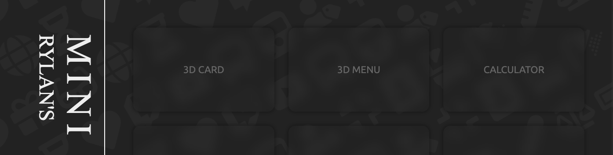
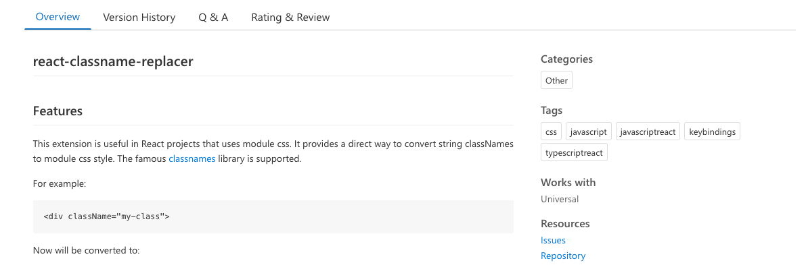
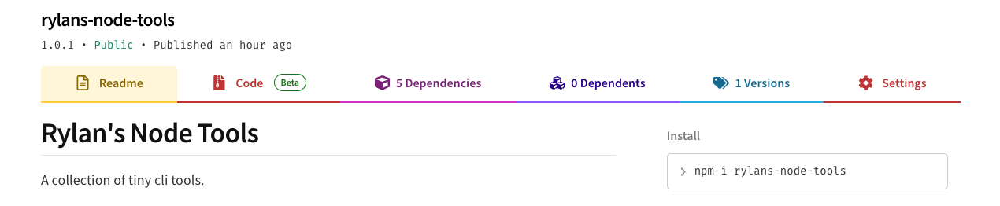
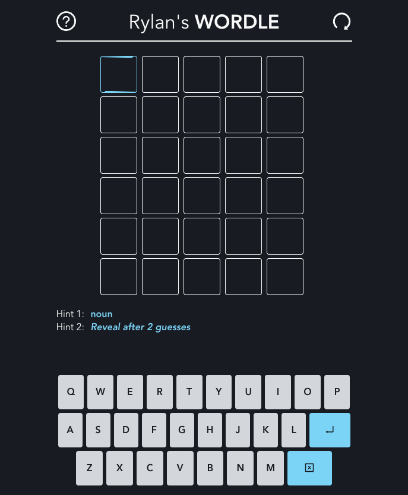
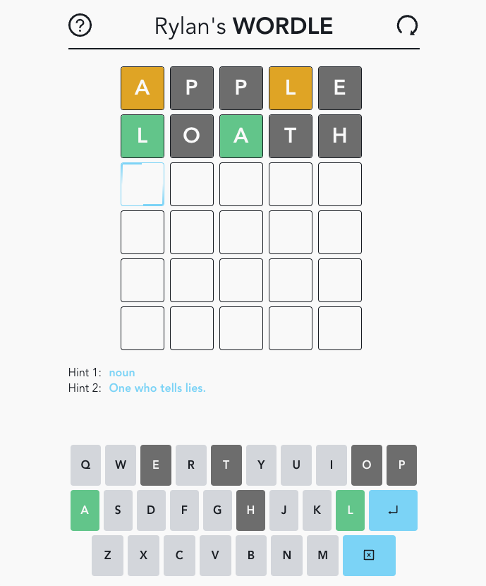

   <h1>Howdy 👋 This is Rylan Zhou 👨🏻‍💻</h1>

<ul style="display: inline-block">
  <li>🖥️ 5-year Software Engineer, Full-Stack Developer</li>
  <li>️🧱 UI/UX Designer & Engineer</li>
  <li>💠 CSS/Scss Purist, Maniac</li>
  <li>🎨 Creator, Photoshop Lover</li>
  <li>🎹 Self-taught Piano Learner</li>
  <li>🇯🇵 日本語 & 🇪🇸 Español Learner</li>
  <li>🦉 Master of Computer Science, Rice University</li>
  <li>☕️ Tea & Coffee Lover</li>
</ul>

  
  
  
  

---

### 🛠️ Technologies

#### Coding Language

#### Frameworks

#### Dev Tools

#### Others

---

### 🚀 Git & Personal Projects

<section>
<h3><a href="https://mini-pages.vercel.app/" target="_blank">Rylan's Mini Pages</a></h3>

A collection and showcase of awesome tiny web visual gadgets / effects.

</section>

<section>
<h3><a href="https://marketplace.visualstudio.com/items?itemName=KumoyasuDev.react-classname-replacer" target="_blank">React-Classname-Replacer</a></h3>

Provides a direct way to convert string classNames to module css style, supporting the <i>classname</i> library.

</section>

<section>
<h3><a href="https://www.npmjs.com/package/rylans-node-tools" target="_blank">Rylan's Node Tools</a>
</h3>

A collection of tiny cli tools.

</section>

<section>
<h3><a href="https://rylans-wordle.vercel.app/" target="_blank">Rylan's Wordle</a>
</h3>

A wordle game fully responsive, in mobile-first design, supporting light/dark mode.

</section>

<section>
<h3 style="color:#666">...and more in coming</h3>
</section>

 

---

